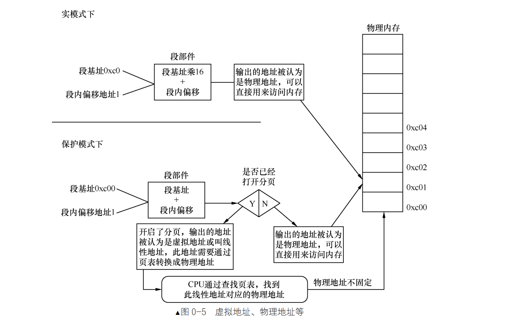

# 

用户态与内核态是对 CPU 来讲的，是指 CPU 运行在用户态（特权 3 级）还是内核态（特权 0 级），很多人误以为是对用户进程来讲的。

用户进程陷入内核态是指：由于内部或外部中断发生，当前进程被暂时终止执行，其上下文被内核的中断程序保存起来后，开始执行一段内核的代码。是内核的代码，不是用户程序在内核的代码，用户代码怎么可能在内核中存在，所以“用户态与内核态”是对 CPU 来说的。

## 8086 CPU 实模式

8086 CPU 有 20 条地址线，可以寻址 1MB 的内存空间

拥有1MB的寻址能力，怎样用 16 位的寄存器表示呢？

这就引出了分段的概念，8086CPU将1MB存储空间分成许多逻辑段，每个段最大限长为64KB（但不一定就是64KB）。这样每个存储单元就可以用“段基地址+段内偏移地址”表示。这样就实现了从16位内部地址到20位实际地址的转换（映射）。段基地址由16位段寄存器值左移4位表达，段内偏移表示相对于某个段起始位置的偏移量。

**段寄存器<<4 + 逻辑地址（16位）= 线性地址 = 物理地址**

## 80386 CPU 保护模式

80386 CPU 有 32 条地址线，可以寻址 4GB 的内存空间，但是为了兼容性考虑，保留了之前的段寄存器，必须支持实模式，还要支持保护模式。80386 增设两个寄存器 一个是全局性的段描述符表寄存器 GDTR(global descriptor table register)，一个是局部性的段描述符表寄存器 LDTR(local descriptor table register)。

分别可以用来指向存储在内存中的一个段描述结构数组，或者称为段描述表。由于这两个寄存器是新增设的，不存在与原有的指令是否兼容的问题，访问这两个寄存器的专用指令便设计成“特权指令”"。

保护模式通过“段选择符+段内偏移”寻址最终的线性地址或物理地址的。

段选择符为16位，它不直接指向段，而是通过指向的段描述符，段描述符再定义段的信息。

## 物理地址、逻辑地址、有效地址、线性地址、虚拟地址的区别

- 物理地址：CPU 访问内存的最终地址，是内存条上的地址，是真实存在的地址。

    - 在实模式下 “段基址 + 段内偏移地址” 经过段部件的处理，直接输出的就是物理地址

    - 在保护模式下，CPU “段基址+段内偏移地址”称为线性地址，

        - 若没有开启地址分页功能，此线性地址就被当作物理地址来用，可直接访问内存。
        - 若开启了分页功能，此线性地址又多了一个名字，就是虚拟地址（虚拟地址、线性地址在分页机制下都是一回事）。虚拟地址要经过 CPU 页部件转换成具体的物理地址，这样 CPU 才能将其送上地址总线去访问内存。

- 无论在实模式或是保护模式下，段内偏移地址又称为有效地址，也称为逻辑地址，这是程序员可见的地址。

- 线性地址或称为虚拟地址，这都不是真实的内存地址。它们都用来描述程序或任务的地址空间。由于分页功能是需要在保护模式下开启的，32 位系统保护模式下的寻址空间是 4GB，所以虚拟地址或线性地址就是 0～4GB 的范围。

 

## 编译型程序与解释型程序的区别

编译型程序：将源代码一次性编译成机器码，然后执行机器码，CPU 能看到源代码（机器码），执行效率高，但是不跨平台。

解释型程序：解释器逐行解释源代码，并执行代码，CPU 看不到源代码，只能看到解释器，执行效率低，但是跨平台。

## 大端序、小端序

大端序：高位字节存放在低位地址，低位字节存放在高位地址。

小端序：高位字节存放在高位地址，低位字节存放在低位地址。

示例： 0x12345678

- 大端序 0x12 0x34 0x56 0x78

- 小端序 0x78 0x56 0x34 0x12

字节序不仅是在 CPU 访问内存中的概念，而且也包括在文件存储和网络传输中。bmp 格式的图片就
属于小端字节序，而 jpeg 格式的图片则为大端字节序，这没什么可说的，采用什么序列完全是开发者设
计产品时的需要。

## BIOS 中断、DOS 中断、Linux 中断的区别

在计算机系统中，无论是在实模式，还是在保护模式，在任何情况下都会有来自外部或内部的事件发生。如果事件来自于 CPU 内部就称为异常，即 Exception。

如果事件来自于 CPU 外部，就称为中断，即 Interrupt。中断是指 CPU 在执行程序的过程中，遇到某些特殊情况时，暂停当前程序的执行，转而去执行相应的处理程序，处理完后再返回断点处继续执行原来的程序。

BIOS 和 DOS 都是存在于实模式下的程序，由它们建立的中断调用都是建立在中断向量表（Interrupt Vector Table，IVT）中的。它们都是通过软中断指令 int 中断号来调用的。

中断向量表中的每个中断向量大小是 4 字节。这 4 字节描述了一个中断处理例程（程序）的段基址和段内偏移地址。因为中断向量表的长度为 1024 字节，故该表最多容纳 256 个中断向量处理程序。计算机启动之初，中断向量表中的中断例程是由 BIOS 建立的，它从物理内存地址 0x0000 处初始化并在中断向量表中添加各种处理例程。

## MBR、EBR、DBR 和 OBR 各是什么

这几个概念主要是围绕计算机系统的控制权交接展开的。

1. 计算机在接电之后运行的是基本输入输出系统 BIOS 

BIOS 位于计算机系统的 ROM 中，它是一组固化在计算机内主板上一个 ROM 芯片上的程序，它保存着计算机最重要的基本输入输出的程序、系统设置信息、开机后自检程序和系统自启动程序。它可提供最底层的、最直接的硬件设置和控制。

2. 下一个接力棒的选手是 MBR，为了方便BIOS 找到 MBR，MBR 必须在固定的位置等待，因此 MBR 位于整个硬盘最开始的扇区。

BIOS 会在计算机启动时，自动检测计算机硬件设备，然后将控制权交给第一个可启动的设备，这个设备就是硬盘。

**MBR 是主引导记录，Master 或 Main Boot Record**，它存在于整个硬盘最开始的那个扇区，即 0 盘 0 道 1 扇区(这是CHS方式)，这个扇区便称为 MBR 引导扇区。

在 MBR 引导扇区中的内容是：

1. 446 字节的引导程序及参数；
2. 64 字节的分区表； --> 里面是分区信息。分区表中每个分区表项占 16 字节，因此 MBR 分区表中可容纳 4 个分区，
3. 2 字节结束标记 0x55 和 0xaa。

MBR 称为“主”引导程序，有“主”就得有“次”， MBR 的作用相当于下一棒的引导程序总入口，BIOS 把控制权交给 MBR 就行了，由 MBR 从众多可能的接力选手中挑出合适的人选并交出系统控制权，这个过程就是由“主引导程序”去找“次引导程序”，MBR 引导扇区中除了引导程序外，还有 64 字节大小的分区表，里面是分区信息。分区表中每个分区表项占 16 字节，因此 MBR 分区表中可容纳 4 个分区，这 4 个分区就是“次引导程序”的候选人群，MBR 引导程序开始遍历这 4 个分区，想找到合适的人选并把系统控制权交给他。

**MBR 如何找到操作系统呢？**

为了让 MBR 知道哪里有操作系统，我们在分区时，如果想在某个分区中安装操作系统，就用分区工具将该分区设置为活动分区，设置活动分区的本质就是把分区表中该分区对应的分区表项中的活动标记为0x80。

活动分区标记位于分区表项中最开始的 1 字节，其值要么为 0x80，要么为 0，其他值都是非法的。0x80 表示此分区上有引导程序，0 表示没引导程序，该分区不可引导。

MBR 在分析分区表时通过辨识“活动分区”的标记 0x80 开始找活动分区，如果找到了，就将 CPU 使用权交给此分区上的引导程序，此引导程序通常是内核加载器。

为了 MBR 方便找到活动分区上的内核加载器，内核加载器的入口地址也必须在固定的位置，这个位置就是各分区最开始的扇区，这也是约定好的。

这个“各分区起始的扇区”中存放的是操作系统引导程序----内核加载器，因此该扇区称为操作系统引导扇区，其中的引导程序（内核加载器）称为操作系统引导记录 OBR，即 OS Boot Record，此扇区也称为 OBR 引导扇区。

在 OBR 扇区的前 3 个字节存放了跳转指令，这同样是约定，因此 MBR 找到活动分区后，就大胆主动跳到活动分区 OBR 引导扇区的起始处，该起始处的跳转指令马上将处理器带入操作系统引导程序，从此 MBR 完成了交接工作，以后便是内核的天下了。

MBR 位于整个硬盘最开始的块，EBR 位于每个子扩展分区，各子扩展分区中只有一个逻辑分区。MBR 和 EBR 位于分区之外的扇区，而 OBR 则属于主分区和逻辑分区最开始的扇区，每个主分区和逻辑分区中都有 OBR 引导扇区。