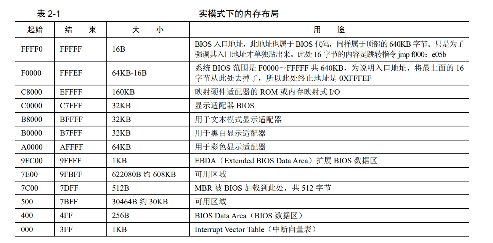
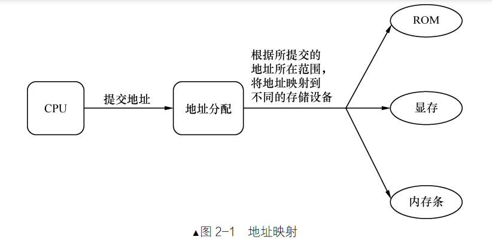

# 第 2 章 编写 MBR 主引导记录，让我们开始掌权

### 2.2.1 实模式下的 1MB 内存布局 

8086 有 20 根地址线，可以寻址 1MB 的内存空间

内存地址 0～0x9FFFF 的空间范围是 640KB，这片地址对应到了 DRAM，也就是插在主板上的内存条。

看顶部的 0xF0000～0xFFFFF，这 64KB 的内存是 ROM。这里面存的就是 BIOS 的代码。BIOS 的主要工作是检测、初始化硬件。

在计算机中，并不是只有咱们插在主板上的内存条需要通过地址总线访问，
还有一些外设同样是需要通过地址总线来访问的，这类设备还很多呢。若把全部的地址总线都指向物理内存，那其他设备该如何访问呢？由于这个原因，只好在地址总线上提前预留出来一些地址空间给这些外设用，这片连续的地址给显存，这片连续的地址给硬盘控制器等。留够了以后，地址总线上其余的可用地址
再指向 DRAM，也就是指插在主板上的内存条、我们眼中的物理内存。示意如图 2-1 所示。

### 2.2.2 BIOS 是如何苏醒的

BIOS 存储在 ROM 中。ROM 是只读存储器，不可写，也不可执行。那么，BIOS 是如何被执行的呢？

BIOS 的入口地址是 0xFFFF0，这个地址是固定的，不会变。当计算机通电后，CPU 会从这个地址开始执行指令。这个地址里面存放的是一条跳转指令，此处16 字节的内容是跳转指令jmp f000:e05b 

所以 cpu cs:ip 一通电就被强制设置为 0xF000:FFF0,这是约定好的

接下来 BIOS 便马不停蹄地检测内存、显卡等外设信息，当检测通过，并初始化好硬件后，开始在内存中 0x000～0x3FF 处建立数据结构，中断向量表 IVT 并填写中断例程。

### 2.2.3 为什么是 0x7c00 

BIOS 最后一项工作校验启动盘中位于 0 盘 0 道 1 扇区的内容。

如果此扇区末尾的两个字节分别是魔数 0x55 和 0xaa，BIOS 便认为此扇区中确实存在可执行的程序（在此先剧透一下，此程序便是久闻大名的主引导记录 MBR），便加载到物理地址 0x7c00，随后跳转到此地址，继续执行。

