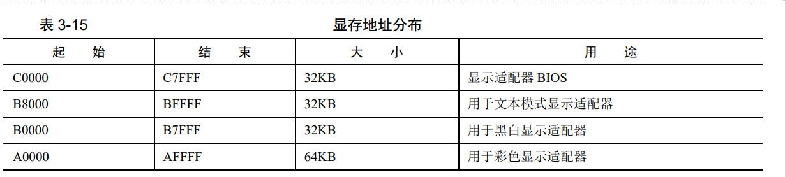
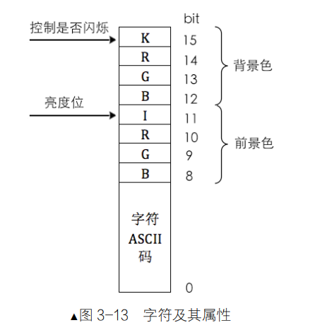

## 3.1.1 什么是地址 

## 3.1.2 什么是 section 

## 3.1.3 什么是 vstart

vstart 是虚拟起始地址，这里面有两个重要的概念，1 虚拟，2 起始。

地址访问策略是根据程序中给出的地址，到地址处去拿东西，所以这个东西要提前在那个地址处准备好了才行，这是永恒不变的。程序中给出的地址，最终是要用来访问物理内存的，所以该地址对应的物理内存必须是你想要的才行，换句话说，必须保证自己想要的东西被加载到那个物理内存位置。这就是程序加载器做的事，根据文件头中给出的各段的位置，将它们加载到内存中的相应地址，这样用户程序才能访问到自己需要的东西。

vstart=xxxx 和 org xxxx 这两个关键字是同一功能，但很多同学都混淆其意义。它们并不是告诉编译器程序加载到地址 xxxx，这似乎一听，好像是编译器有加载器的功能了，“加载”不是它的工作，这是加载器的工作，编译器只会规划代码，只会为程序编址，并不负责加载。vstart 和 org，它们的功能是告诉编译器：“嘿，老兄，你帮我把后面所有数据（指令和变量）的地址以 xxxx 为起始开始编吧”。


## 3.3.1 CPU 如何与外设通信—IO 接口

##### 为什么需要 IO 接口？

外设的接口和 CPU 的接口不一样，CPU 的接口是总线，而外设的接口是各种各样的，比如 USB 接口，PS/2 接口，VGA 接口，网口接口等等，这些接口都是不同的，所以 CPU 不能直接和外设通信，需要一个中间的桥梁，这个桥梁就是 IO 接口。

##### IO 接口的作用是什么？

1. 设置数据缓冲，解决 CPU 与外设的速度不匹配

2. 设置信号电平转换电路

CPU 和外设的信号电平不同，如 CPU 所用的信号是 TTL 电平，而外设大多数是机电设备，故不能使
用 TTL 电平驱动，可以在接口电路中设置电平转换电路来解决。

3. 设置数据格式转换 

外设是多种多样的，输出的信息可能是数字信号、模拟信号等，而 CPU 只能处理数字信号。数字信号需要经过数/模转换（D/A）成模拟量才能被送到外设以驱动硬件，模拟量也同样需要经过模/数（A/D）转换成数字量才能被 CPU 处理。

4. 设置时序控制电路来同步 CPU 和外部设备

5. 提供地址译码 
 
IO 接口在诞生之初，就被设计成要通过寄存器的方式同 CPU 通信，其内部有专用于数据交互的寄存器，只不过这里所说的这些寄存器位于 IO 接口中，为了区别于 CPU 内部的寄存器，IO 接口中的寄存器就称为端口（这可不是网络应用程序所开的那种端口，如网络服务器会启动 80 端口，这是两码事）。

IO 接口是连接 CPU 和硬件的桥梁，一端是 CPU，另一端是硬件。端口是 IO 接口开放给 CPU 的接口，一般的 IO 接口都有一组端口，每个端口都有自己的用途，甚至有时，一个端口在不同情况下有不同的用途。

##### 如何访问端口?

IA32 体系系统中，因为用于存储端口号的寄存器是 16 位的，所以最大有 65536 个端口，即 0～65535。

要是通过内存映射，端口就可以用 mov 指令来操作。但由于用的是独立编址，所以就不能把它当作内存来操作，因此 CPU 提供了专门的指令来干这事，in 和 out。

Intel 汇编语言的形式是：操作码目的操作数，源操作数。Intel 采用这种格式的原因可能是觉得这样表达“目的操作数”=“源操作数”更形象，如同 a=6 这种形式。

**in **指令用于从端口读数据，一般形式为：

- in al,dx
- in ax,dx

其中 al 和 ax 用来存储从端口获取的数据，dx 是指端口号。

这是固定用法，只要用 in 指令，源操作数（端口号）必须是 dx，而目的操作数是用 al，还是 ax，取决于 dx 端口指代的寄存器是 8 位宽度，还是 16 位宽度。

**out **指令用于往端口中写数据，其一般形式是：

- out dx, al；
- out dx,ax；
- out 立即数, al；
- out 立即数, ax。
 
注意啦，这和 in 指令相反，in 指令的源操作数是端口号，而 out 指令中的目的操作数是端口号。

1. 在以上两个指令中，dx 只做端口号之用，无论其是源操作数或目的操作数。

2. in 指令从端口读数据，可以认为端口是数据源，所以端口出现在“源操作数”的位置。读出来的数据要有个“目的地”来存放，所以 in 指令中存放数据的地方出现在“目的操作数”位置。out 指令是把数据写入端口指向的寄存器，在这里，端口是数据的“目的地”，所以端口出现在目的操作数的位置。待写入的数据总该有个“来源”，所以 out 指令中的“源操作数”是数据来源。在以上的两个指令中，端口号和数据的位置，取决于它们各自的角色是源操作数，还是目的操作数。

3. 在以上两个指令的两个操作数中，无论是对于源操作数，还是目的操作数，除端口号外，那个作为数据的操作数（in 指令中作为数据目的地，out 指令中作为数据源），一律用 al 寄存器存储 8 位宽度的数据，用 ax 寄存器存储 16 位宽度的数据，至于用 al，还是 ax 存数据，要看端口指向的寄存器宽度是多少，它要和端口寄存器的位宽保持一致，不能丢失数据精度。

4. in 指令中，端口号只能用 dx 寄存器。

5. out 指令中，可以选用 dx 寄存器或立即数充当端口号。


##### 显存、显卡、显示器

显存：显存是显卡上的一块内存，用于存储图像数据，显存的大小决定了显卡能够显示的分辨率和色深。

显卡：是计算机和显示器之间的一个重要IO接口，它的主要功能是把计算机内存(显存)中的图形信息转换成显示器能够识别的视频信号，然后再传送到显示器上显示出来。

显示器：是一种用来显示计算机图像的输出设备，是计算机最重要的输出设备之一，通常由显示屏和显示电路两大部分组成。



显卡支持三种模式，文本模式、黑白图形模式、彩色图形模式。

屏幕上每个字符的低字节是字符的 ASCII 码，高字节是字符属性元信息。在高字节中，低 4 位是字符前景色，高 4 位是字符的背景色。颜色用 RGB 红绿蓝三种基色调和，第 4 位用来控制亮度，若置 1 则呈高亮，若为 0 则为一般正常亮度值。第 7 位用来控制字符是否闪烁（不是背景闪烁）。这两字节如图 3-13 所示。


不使用bios中断的显示字符串功能，直接使用显卡在内存中的映射来显示字符
```s
                                        ;主引导程序 
                                        ;
                                        ;LOADER_BASE_ADDR equ 0xA000 
                                        ;LOADER_START_SECTOR equ 0x2
                                        ;------------------------------------------------------------
SECTION MBR vstart=0x7c00         
    mov ax,cs      
    mov ds,ax
    mov es,ax
    mov ss,ax
    mov fs,ax
    mov sp,0x7c00
    mov ax,0xb800
    mov gs,ax

                                        ; 清屏
                                        ;利用0x06号功能，上卷全部行，则可清屏。
                                        ; -----------------------------------------------------------
                                        ;INT 0x10   功能号:0x06	   功能描述:上卷窗口
                                        ;------------------------------------------------------
                                        ;输入：
                                        ;AH 功能号= 0x06
                                        ;AL = 上卷的行数(如果为0,表示全部)
                                        ;BH = 上卷行属性
                                        ;(CL,CH) = 窗口左上角的(X,Y)位置
                                        ;(DL,DH) = 窗口右下角的(X,Y)位置
                                        ;无返回值：
    mov ax, 0600h
    mov bx, 0700h
    mov cx, 0                           ; 左上角: (0, 0)
    mov dx, 184fh	                    ; 右下角: (80,25),
			                            ; 因为VGA文本模式中，一行只能容纳80个字符,共25行。
			                            ; 下标从0开始，所以0x18=24,0x4f=79
    int 10h                             ; int 10h

                                        ; 输出背景色绿色，前景色红色，并且跳动的字符串"1 MBR"
    mov byte [gs:0x00],'1'
    mov byte [gs:0x01],0xA4             ; A表示绿色背景闪烁，4表示前景色为红色

    mov byte [gs:0x02],' '
    mov byte [gs:0x03],0xA4

    mov byte [gs:0x04],'M'
    mov byte [gs:0x05],0xA4   

    mov byte [gs:0x06],'B'
    mov byte [gs:0x07],0xA4

    mov byte [gs:0x08],'R'
    mov byte [gs:0x09],0xA4

    jmp $		                        ; 通过死循环使程序悬停在此

    times 510-($-$$) db 0
    db 0x55,0xaa


```


## 3.6 让MBR 使用硬盘

接下来我们要用MBR做点实事了，MBR只有512Byte，能做的事情非常少，所以不能指望它做完所有事情。所以，我们用它把操作系统的loader加载到指定位置，然后跳转到loader执行，loader由于大小可以比MBR大得多，所以能做的就很多了。所以，MBR要加载loader，就必须要和磁盘打交道。打交道的方式很简单，就是通过in 与out指令与磁盘暴露在外的寄存器交互。

**in**指令用于从端口读数据，一般形式为：

- in al,dx
- in ax,dx

其中 al 和 ax 用来存储从端口获取的数据，dx 是指端口号。

这是固定用法，只要用 in 指令，源操作数（端口号）必须是 dx，而目的操作数是用 al，还是 ax，取决于 dx 端口指代的寄存器是 8 位宽度，还是 16 位宽度。

**out**指令用于往端口中写数据，其一般形式是：

- out dx, al；
- out dx,ax；
- out 立即数, al；
- out 立即数, ax。

磁盘端口寄存器对应的用途

其中Status与Device寄存器比较复杂，它们的结构的含义如下：


硬盘操作的七个步骤：

- 先选择通道，往该通道的 sector count 寄存器中写入待操作的扇区数。
- 往该通道上的三个 LBA 寄存器写入扇区起始地址的低 24 位。
- 往 device 寄存器中写入 LBA 地址的 24～27 位，并置第 6 位为 1，使其为 LBA 模式，设置第 4 位，选择操作的硬盘（master 硬盘或 slave 硬盘）。
- 往该通道上的 command 寄存器写入操作命令。
- 读取该通道上的 status 寄存器，判断硬盘工作是否完成。
- 如果以上步骤是读硬盘，进入下一个步骤。否则，完工。
- 将硬盘数据读出。

/src/boot/inlucde/boot.inc
```s
                                    ;-------------	 loader和kernel   ----------
LOADER_BASE_ADDR equ 0x900 
LOADER_START_SECTOR equ 0x2


```

/src/boot/boot.asm
```s
                                    ;主引导程序 
                                    ;------------------------------------------------------------
%include "boot.inc"
SECTION MBR vstart=0x7c00         
    mov ax,cs      
    mov ds,ax
    mov es,ax
    mov ss,ax
    mov fs,ax
    mov sp,0x7c00
    mov ax,0xb800
    mov gs,ax

                                    ; 清屏
                                    ;利用0x06号功能，上卷全部行，则可清屏。
                                    ; -----------------------------------------------------------
                                    ;INT 0x10   功能号:0x06	   功能描述:上卷窗口
                                    ;------------------------------------------------------
                                    ;输入：
                                    ;AH 功能号= 0x06
                                    ;AL = 上卷的行数(如果为0,表示全部)
                                    ;BH = 上卷行属性
                                    ;(CL,CH) = 窗口左上角的(X,Y)位置
                                    ;(DL,DH) = 窗口右下角的(X,Y)位置
                                    ;无返回值：
    mov ax, 0600h
    mov bx, 0700h
    mov cx, 0                       ; 左上角: (0, 0)
    mov dx, 184fh		            ; 右下角: (80,25),
				                    ; 因为VGA文本模式中，一行只能容纳80个字符,共25行。
				                    ; 下标从0开始，所以0x18=24,0x4f=79
    int 10h                         ; int 10h

                                    ; 输出字符串:MBR
    mov byte [gs:0x00],'1'
    mov byte [gs:0x01],0xA4

    mov byte [gs:0x02],' '
    mov byte [gs:0x03],0xA4

    mov byte [gs:0x04],'M'
    mov byte [gs:0x05],0xA4	        ;A表示绿色背景闪烁，4表示前景色为红色

    mov byte [gs:0x06],'B'
    mov byte [gs:0x07],0xA4

    mov byte [gs:0x08],'R'
    mov byte [gs:0x09],0xA4
	 
    mov eax,LOADER_START_SECTOR	    ; 起始扇区LBA模式地址 LBA地址长度为28
    mov bx,LOADER_BASE_ADDR         ; 写入的地址
    mov cx,1			            ; 待读入的扇区数
    call rd_disk_m_16		        ; 以下读取程序的起始部分（一个扇区）
    
    cmp word [0x900],0x55aa         ; 判断是否为有效的引导扇区
    jnz error                       ; 如果不是则跳转到error
    jmp LOADER_BASE_ADDR            ; 跳转到loader

print:
    mov ah,0x0e
.next
    mov al,[si]
    cmp al,0
    jz .done
    int 0x10
    inc si
    jmp .next
.done
    ret

error:
    mov si, .msg
    call print
    hlt ; 让cpu 停止
    .msg db "Booting error !!!",10,13,0

                                    ;-------------------------------------------------------------------------------
                                    ;功能:读取硬盘n个扇区
rd_disk_m_16:	   
                                    ;-------------------------------------------------------------------------------
				                    ; eax=LBA扇区号
				                    ; ebx=将数据写入的内存地址
				                    ; ecx=读入的扇区数
    mov esi,eax	                    ;备份eax
    mov di,cx		                ;备份cx
                                    ;读写硬盘:
                                    ;第1步：选择特定通道的寄存器(sector count)，设置要读取的扇区数 (1)
    mov dx,0x1f2                    ;见 primary 通道设置为 0x1f2 选择的是sector count 寄存器
    mov al,cl                       ; cl = 1
    out dx,al                       ;读取的扇区数

    mov eax,esi	                    ;恢复exa 即 loader 存放扇区的地址( 0x900) 

                                    ;第2步：在特定通道寄存器中放入要读取扇区的地址(0x900)，将LBA地址存入0x1f3 ~ 0x1f6
                                    ;LBA地址7~0位写入端口0x1f3
    mov dx,0x1f3                       
    out dx,al                          

                                    ;LBA地址15~8位写入端口0x1f4
    mov cl,8                        
    shr eax,cl                      ; shr 将exa右移 cl(8) 位, 
    mov dx,0x1f4
    out dx,al

                                    ;LBA地址23~16位写入端口0x1f5
    shr eax,cl
    mov dx,0x1f5
    out dx,al
                                    ;设置device寄存器的值，LBA地址的24 ~ 27位放入device 的低四位，高四位设置为1110
    shr eax,cl
    and al,0x0f	                    ;LBA第24~27位 LBA 地址长度28 所以这里只有低四位有意义 
    or al,0xe0	                    ;设置7～4位为1110,表示LBA模式且选择主盘
    mov dx,0x1f6
    out dx,al

                                    ;第3步：向0x1f7端口写入 读命令(0x20) 
    mov dx,0x1f7
    mov al,0x20                        
    out dx,al

                                    ;第4步：检测硬盘状态
.not_ready:
                                    ;同一端口，写时表示写入命令字，读时表示读入硬盘状态
    nop
    in al,dx
    and al,0x88	                    ;第4位为1表示硬盘控制器已准备好数据传输，第7位为1表示硬盘忙
    cmp al,0x08
    jnz .not_ready	                ;若未准备好，继续等。

                                    ;第5步：从0x1f0端口读数据
    mov ax, di                      ;di当中存储的是要读取的扇区数(1)
    mov dx, 256                     ;每个扇区512字节，一次读取两个字节，所以一个扇区就要读取256次，与扇区数相乘，就等得到总读取次数
    mul dx                          ;8位乘法与16位乘法知识查看书p133,注意：16位乘法会改变dx的值！！！！
    mov cx, ax	                    ; 得到了要读取的总次数，然后将这个数字放入cx中
    mov dx, 0x1f0                   ;设置读端口寄存器
.go_on_read:
    in ax,dx
    mov [ds:bx],ax
    add bx,2		  
    loop .go_on_read
    ret

    times 510-($-$$) db 0
    db 0x55,0xaa

```

/src/boot/loader.asm
```s
%include "boot.inc"
section loader vstart=LOADER_BASE_ADDR

dw 0x55aa                           ; 魔数

xchg bx,bx                           ; bochs 魔数断点
                                    ; 输出背景色绿色，前景色红色，并且跳动的字符串"1 MBR"
mov byte [gs:0x00],'2'
mov byte [gs:0x01],0xA4             ; A表示绿色背景闪烁，4表示前景色为红色

mov byte [gs:0x02],' '
mov byte [gs:0x03],0xA4

mov byte [gs:0x04],'L'
mov byte [gs:0x05],0xA4   

mov byte [gs:0x06],'O'
mov byte [gs:0x07],0xA4

mov byte [gs:0x08],'A'
mov byte [gs:0x09],0xA4

mov byte [gs:0x0a],'D'
mov byte [gs:0x0b],0xA4

mov byte [gs:0x0c],'E'
mov byte [gs:0x0d],0xA4

mov byte [gs:0x0e],'R'
mov byte [gs:0x0f],0xA4

mov byte [gs:0x10],'!'
mov byte [gs:0x11],0xA4

jmp $		                        ; 通过死循环使程序悬停在此

````


