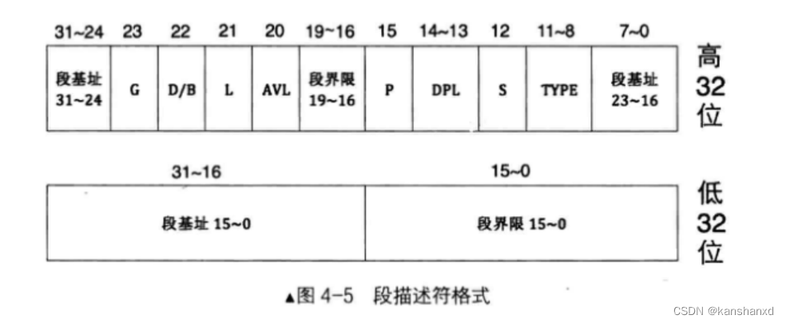
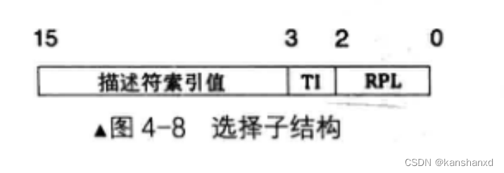

# 保护模式入门

## 内存检测

OS 需要跑在不同的机器上，因此需要检测内存的大小，以便在内存中分配空间。

BIOS 0x15 0xe820  提供了内存检测功能 返回一个 ARDS

Address Range Descriptor Structure (ARDS 20 字节) 用于描述内存段的结构体


|  字节偏移量 | 属性名称     | 描述                             |
| ---------- | ------------ | -------------------------------- |
| 0          | BaseAddrLow  | 基地址的低 32 位                 |
| 4          | BaseAddrHigh | 基地址的高 32 位                 |
| 8          | LengthLow    | 内存长度的低 32 位，以字节为单位 |
| 12         | LengthHigh   | 内存长度的高 32 位，以字节为单位 |
| 16         | Type         | 本段内存的类型                   |

**Type字段**

| Type 值 | 名称                 | 描述                                                                                 |
| ------- | -------------------- | ------------------------------------------------------------------------------------ |
| 1       | AddressRangeMemory   | 这段内存可以被操作系统使用                                                           |
| 2       | AddressRangeReserved | 内存使用中或者被系统保留，操作系统不可以用此内存                                     |
| 3       |                      | 存储ACPI表，可以被操作系统回收。|
| 4       |                      | 操作系统不可使用这段内存。|
| 5       |                      | 已经损坏的内存区域，不可使用。|
| 其他    | 未定义               | 未定义，将来会用到．目前保留． 但是需要操作系统一样将其视为ARR(AddressRangeReserved) |

**int 0x15 中断**


| 寄存器或状态位 | 参数用途                                                                                                                                                                                                                                                                                                 |
| -------------- | -------------------------------------------------------------------------------------------------------------------------------------------------------------------------------------------------------------------------------------------------------------------------------------------------------- |
| EAX            | 子功能号： EAX 寄存器用来指定子功能号，此处输入为 0xE820                                                                                                                                                                                                                                                 |
| EBX            | 内存信息需要按类型分多次返回，由于每次执行一次中断都只返回一种类型内存的ARDS 结构，所以要记录下一个待返回的内存ARDS，在下一次中断调用时通过此值告诉 BIOS 该返回哪个 ARDS，这就是后续值的作用。第一次调用时一定要置为0，EBX 具体值我们不用关注，字取决于具体 BIOS 的实现，每次中断返回后，BIOS 会更新此值 |
| ES: DI         | ARDS 缓冲区：BIOS 将获取到的内存信息写入此寄存器指向的内存，每次都以 ARDS 格式返回                                                                                                                                                                                                                       |
| ECX            | ARDS 结构的字节大小：用来指示 BIOS 写入的字节数。调用者和 BIOS 都同时支持的大小是 20 字节，将来也许会扩展此结构                                                                                                                                                                                          |
| EDX            | 固定为签名标记 `0x534d4150`，此十六进制数字是字符串 `SMAP` 的ASCII 码： BIOS 将调用者正在请求的内存信息写入 ES: DI 寄存器所指向的ARDS 缓冲区后，再用此签名校验其中的信息                                                                                                                                 |

在 loader.asm 中加入内存检测
```s
detect_memory:
    xor ebx, ebx                    ; 将ebx清零 xor 效率高于 mov

                                    ; 将 es:edi 指向 adrs_buffer
    mov ax,0
    mov es,ax                       
    mov edi,adrs_buffer             

    mov edx, 0x534d4150             ; "SMAP" 固定签名

.next
    mov eax, 0xe820                 ; BIOS 中断 0x15 功能号
    mov ecx, 20                     ; adrs 大小 单位字节

    int 0x15                        ; 调用 BIOS 中断

                                    ; 检测返回值
    jc error                        ; 如果 CF=1 则发生错误，跳转到 error 标号处  
    add di,cx                       ; 将缓存指针指向下一个结构体

    inc word [adrs_count]           ; 将结构体数量加一

    cmp ebx,0                       ; ebx 为 0 说明已经遍历完所有结构体,检测结束
    jne .next                       ; 如果 ebx 不为 0 则继续循环

    mov si,detecting
    call print

    xchg bx,bx                      ; bochs 魔数断点


                                    ; 将adrs 缓冲区内容送入 eax, ebx ,edx 查看
    mov cx,[adrs_count]             ; 将结构体数量存入 ax

    mov si,0                         ; 初始化结构体指针

.show:
    mov eax, [adrs_buffer+si]       
    mov ebx, [adrs_buffer+si+8]
    mov edx, [adrs_buffer+si+16]
    add si, 20
    xchg bx,bx 
    loop .show
```


## 保护模式

### 8086 CPU 实模式

8086 CPU 有 20 条地址线，可以寻址 1MB 的内存空间

拥有1MB的寻址能力，怎样用 16 位的寄存器表示呢？

这就引出了分段的概念，8086CPU将1MB存储空间分成许多逻辑段，每个段最大限长为64KB（但不一定就是64KB）。这样每个存储单元就可以用“段基地址+段内偏移地址”表示。这样就实现了从16位内部地址到20位实际地址的转换（映射）。段基地址由16位段寄存器值左移4位表达，段内偏移表示相对于某个段起始位置的偏移量。

**段寄存器<<4 + 逻辑地址（16位）= 线性地址 = 物理地址**

### 80386 CPU 保护模式

80386 CPU 有 32 条地址线，可以寻址 4GB 的内存空间，但是为了兼容性考虑，保留了之前的段寄存器，必须支持实模式，还要支持保护模式。80386 增设两个寄存器 一个是全局性的段描述符表寄存器 GDTR(global descriptor table register)，一个是局部性的段描述符表寄存器 LDTR(local descriptor table register)。

分别可以用来指向存储在内存中的一个段描述结构数组，或者称为段描述表。由于这两个寄存器是新增设的，不存在与原有的指令是否兼容的问题，访问这两个寄存器的专用指令便设计成“特权指令”"。

保护模式通过“段选择符+段内偏移”寻址最终的线性地址或物理地址的。

段选择符为16位，它不直接指向段，而是通过指向的段描述符，段描述符再定义段的信息。

#### 全局描述符 

80386-segment descriptor


主要信息：
- 内存的起始位置
- 内存的长度 / 界限 = 长度 - 1
- 内存属性

```c
typedef struct descriptor /* 共 8 个字节 */
{
    unsigned short limit_low;      // 段界限 0 ~ 15 位
    unsigned int base_low : 24;    // 基地址 0 ~ 23 位 16M
    unsigned char type : 4;        // 段类型
    unsigned char segment : 1;     // 1 表示代码段或数据段，0 表示系统段
    unsigned char DPL : 2;         // Descriptor Privilege Level 描述符特权等级 0 ~ 3
    unsigned char present : 1;     // 存在位，1 在内存中，0 在磁盘上
    unsigned char limit_high : 4;  // 段界限 16 ~ 19;
    unsigned char available : 1;   // 该安排的都安排了，送给操作系统吧
    unsigned char long_mode : 1;   // 64 位扩展标志
    unsigned char big : 1;         // 32 位 还是 16 位;
    unsigned char granularity : 1; // 粒度 4KB 或 1B
    unsigned char base_high;       // 基地址 24 ~ 31 位
} __attribute__((packed)) descriptor;
```
**Type** 字段

| X | C/E | R/W | A |


- A: Accessed 是否被 CPU 访问过
- X: 1/代码 0/数据
- X = 1：代码段
    - C: 是否是依从代码段
    - R: 是否可读
- X = 0: 数据段
    - E: 0 向上扩展 / 1 向下扩展
    - W: 是否可写


#### 全局描述符表 GDT (Global Descriptor Table)

GDT 是一个数组，每个元素是一个段描述符，每个段描述符描述一个段，段的信息包括段的起始地址、段的大小、段的属性等。

总共有 8192 个段描述符，每个段描述符 8 个字节，所以 GDT 的大小为 8192 * 8 = 65536 字节，也就是 64KB。
```c
descriptor gdt[8192];
```

GDT表第0个段描述符不可用。

GDTR 寄存器：全局描述符表寄存器，用来存放 GDT 的起始地址和大小。

##### 全局描述符指针

全局描述符指针描述了**全局描述符表**的基地址和界限

```c
typedef struct pointer
{
    unsigned short limit; // size - 1
    unsigned int base;
} __attribute__((packed)) pointer;
```
使用：
```s
lgdt [gdt_ptr]; 加载 gdt
sgdt [gdt_ptr]; 保存 gdt
```

全局描述符指针描述了**全局描述符表**的基地址和界限

#### 段选择子

段选择子用于指定段描述符在 GDT 中的位置，段选择子是一个 16 位的寄存器，它的结构如下图所示：



```c
typedef struct selector
{
    unsigned char RPL : 2; // Request PL 
    unsigned char TI : 1; // 0  全局描述符 1 局部描述符 LDT Local 
    unsigned short index : 13; // 全局描述符表索引
} __attribute__((packed)) selector;
```

### A20 线

A20 线是 80386 CPU 的一个地址线，它的作用是控制 CPU 对内存的访问范围，当 A20 线为高电平时，CPU 可以访问 1MB 以上的内存，当 A20 线为低电平时，CPU 只能访问 1MB 以下的内存。

所以在保护模式下，必须将 A20 线设置为高电平，否则 CPU 将无法访问 1MB 以上的内存。

开启方式：

```s
in al, 0x92
or al, 0b0010
out 0x92, al
```

### 启动保护模式

cr0 寄存器 0 位 置为 1
```asm
mov eax, cr0
or eax, 1
mov cr0, eax
```

## 在 loader 中开启保护模式

编写思路：

- 1. 初始化 GDT
- 2. 初始化 GDTR
- 3. 开启保护模式

## 从 loader 到 kernel加载进内存

与MBR加载loader进内存类似，只是需要注意的是 kernel 的大小更大，需要多次读取扇区。

修改目录结构 makefile .bochsrc

目录结构：
```bash
--- build
    |--- boot
    |--- kernel
    |--- system.bin
    |--- system.map
    |--- master.img
--- src
    |--- boot
        --- boot.asm
        --- loader.asm
    |--- kernel
        --- start.asm
    |--- makefile
```
/src/makefile
```bash
BUILD:=../build
SRC:=.
ENTRYPOINT:=0x10000

.PHONY:bochs clean

bochs:$(BUILD)/master.img
	bochs -q

# 编译引导程序
$(BUILD)/boot/%.bin: $(SRC)/boot/%.asm
	$(shell mkdir -p $(dir $@))
	nasm -f bin $< -o $@
# 编译内核
$(BUILD)/kernel/%.o: $(SRC)/kernel/%.asm
	$(shell mkdir -p $(dir $@))
	nasm -f elf32 $< -o $@
# 编译内核
$(BUILD)/kernel.bin: $(BUILD)/kernel/start.o
	$(shell mkdir -p $(dir $@))
	ld -m elf_i386 -static $^ -o $@ -Ttext $(ENTRYPOINT)
# 编译系统
$(BUILD)/system.bin: $(BUILD)/kernel.bin
	objcopy -O binary $< $@

# 生成内核符号表
$(BUILD)/system.map: $(BUILD)/kernel.bin
	nm $< | sort > $@

# 生成镜像文件
$(BUILD)/master.img: $(BUILD)/boot/boot.bin \
	$(BUILD)/boot/loader.bin \
	$(BUILD)/system.bin \
	$(BUILD)/system.map

	yes | bximage -q -hd=16 -func=create -sectsize=512 -imgmode=flat $@ 
	dd if=$(BUILD)/boot/boot.bin of=$@ seek=0 bs=512 count=1 conv=notrunc
	dd if=$(BUILD)/boot/loader.bin of=$@ seek=2 bs=512 count=4 conv=notrunc
	dd if=$(BUILD)/system.bin of=$@ seek=10 bs=512 count=200 conv=notrunc
clean:
	rm -rf $(BUILD)

test: $(BUILD)/master.img
```

/src/.bochsrc
```bash
ata0-master: type=disk, path="../build/master.img", mode=flat
```

简单的内核代码

/src/kernel/start.asm
```s
[bits 32]

global _start
_start:
                                          ; 打印字符 kernel
    mov byte [0xb8000], 'k'
    mov byte [0xb8002], 'e'
    mov byte [0xb8004], 'r'
    mov byte [0xb8006], 'n'
    mov byte [0xb8008], 'e'
    mov byte [0xb800a], 'l'

    jmp $
```

loader 中加载内核，只需要把boot.asm 中的加载loader的代码复制到 loader.asm 中即可。注意参数的修改。我们需要把内核加载到 0x10000 的位置，内核放在 10 号扇区，共 200 个扇区，所以需要修改的参数如下：
```s
    mov edi, 0x10000                ; 读取的目标内存
    mov ecx, 10                     ; 起始扇区
    mov bl, 200                     ; 扇区数量

    xchg bx,bx                      ; bochs 魔数断点
    call read_disk


    xchg bx,bx                      ; bochs 魔数断点

    jmp code_selector:0x10000       ; 跳转到内核入口地址
```


